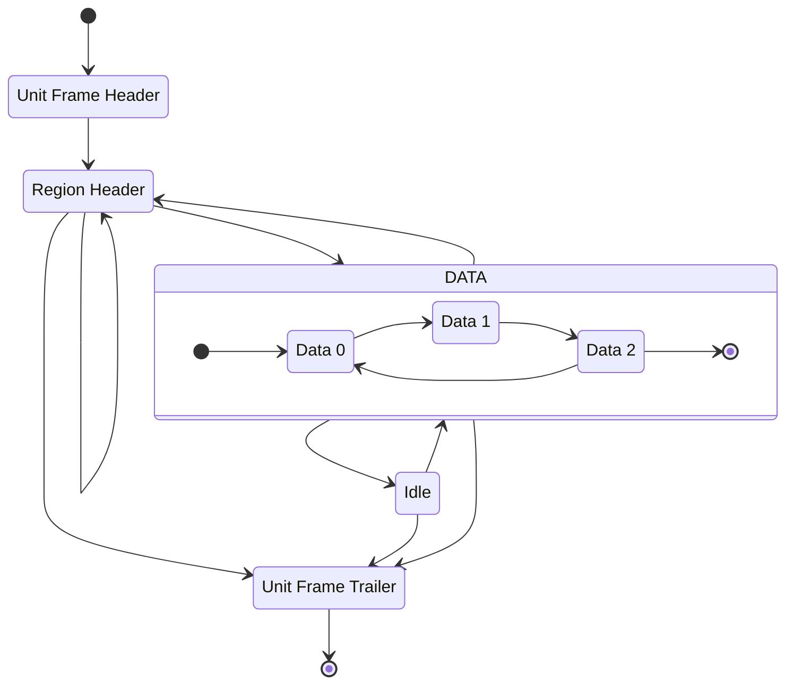
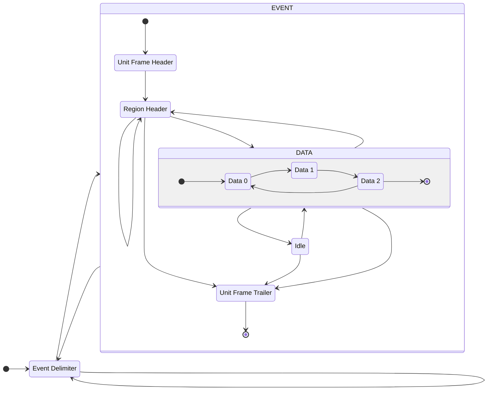

# MOSS Decoder
[](https://github.com/CramBL/moss_decoder/actions/workflows/CI.yml)


Python module implemented in Rust for decoding raw data from the MOSS chip (Stitched Monolithic Pixel Sensor prototype).

- [MOSS Decoder](#moss-decoder)
  - [Installation](#installation)
    - [Example](#example)
  - [Motivation \& Purpose](#motivation--purpose)
  - [MOSS event data packet protocol FSM](#moss-event-data-packet-protocol-fsm)
  - [Multiple event decoder FSM](#multiple-event-decoder-fsm)
  - [@CERN Gitlab installation for CentOS and similar distributions from local build](#cern-gitlab-installation-for-centos-and-similar-distributions-from-local-build)
    - [Troubleshooting](#troubleshooting)

## Installation
```shell
$ pip install moss-decoder
```
Import in python and use for decoding raw data.
### Example
```python
import moss_decoder

moss_packet = moss_decoder.decode_from_file("path/to/raw_data.raw")
print(moss_packet[0])
# Unit ID: 6 Hits: 44
#  [MossHit { region: 0, row: 3, column: 11 }, MossHit { region: 0, row: 18, column: 243 }, ...
print(moss_packet[0].hits[0])
# reg: 0 row: 3 col: 11
```
## Motivation & Purpose
Decoding in native Python is slow and the MOSS verification team at CERN got to a point where we needed more performance.

Earliest version of a Rust package gave massive improvements as shown in the benchmark below.

Decoding 10 MB MOSS readout data with 100k event data packets and ~2.7 million hits. Performed on CentOS Stream 9 with Python 3.11

| Command                                          |       Mean [s] | Min [s] | Max [s] |      Relative |
| :----------------------------------------------- | -------------: | ------: | ------: | ------------: |
| `python moss_test/util/decoder_native_python.py` | 36.319 ± 0.175 |  36.057 |  36.568 | 228.19 ± 2.70 |
| `python moss_test/util/decoder_rust_package.py`  |  0.159 ± 0.002 |   0.157 |   0.165 |          1.00 |

## MOSS event data packet protocol FSM



## Multiple event decoder FSM
If the decoder is decoding data containing multiple events, the following FSM is used.
The `delimiter` is expected to be `0xFA`. The default `Idle` value `0xFF` is also assumed.

## @CERN Gitlab installation for CentOS and similar distributions from local build

If you update the package source code and want to build and install without publishing and fetching from PyPI, you can follow these steps.

The `.CERN-gitlab-ci.yml` file contains a `build-centos` manual job which will build the MOSS decoder package from source and saves the package as an artifact.

1. Start the job, download the artifacts.
2. Unzip the artifacts and you will find a `wheels` package in `/target/wheels/` with the `.whl` extension
3. Run `python -m pip install <wheels package>.whl`
4. Confirm the installation with `python -m pip freeze | grep moss`, it should display something containing `moss_decoder @ file:<your-path-to-wheels-package>`

### Troubleshooting
if you get `ERROR: Could not find a version that satisfies the requirement ...` make sure to add `.whl` when performing step 3 above.

if you don't see the expected message at step 4, try running the installation command in step 3 with any or all of these options `--upgrade --no-cache-dir --force-reinstall`.
